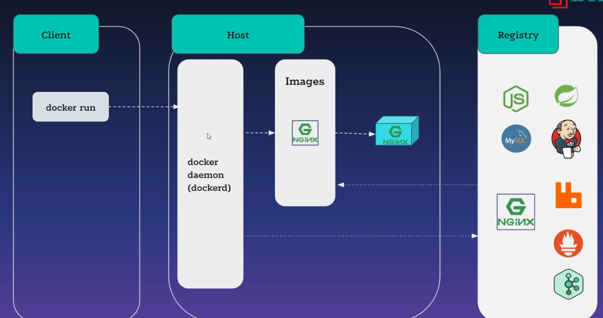
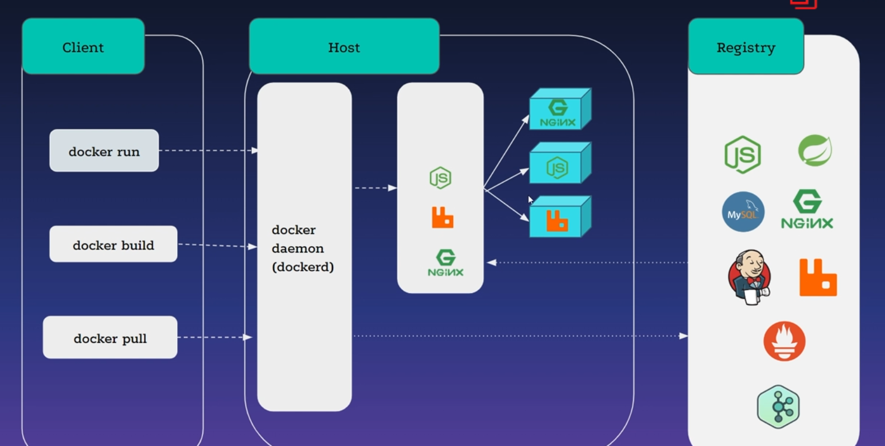
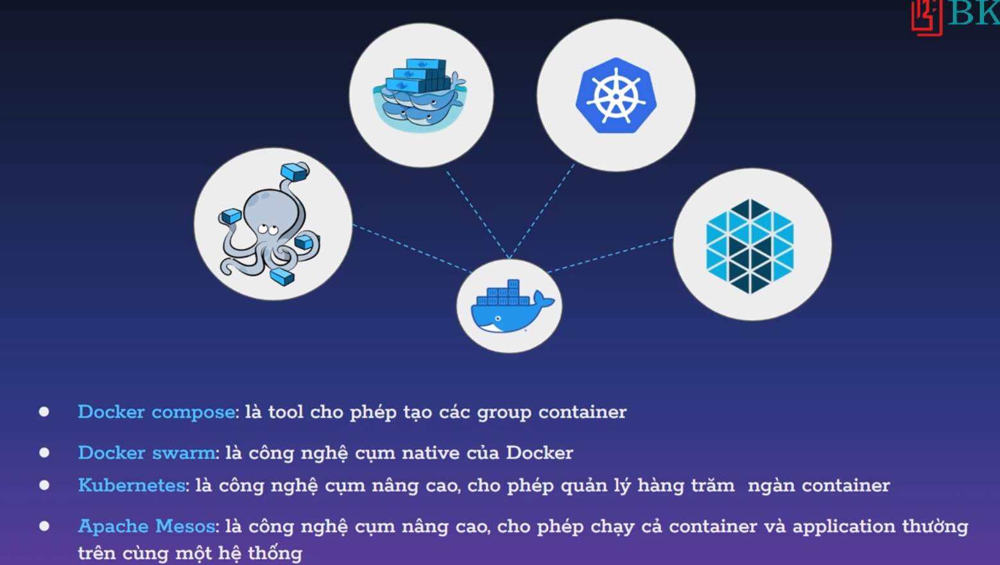

# Cách Docker hoạt động

## Kiến trúc của Docker

> Gồm docker client, docker host, docker registry

- Docker client: giao diện dòng lệnh (docker run, docker pull,... ) hoặc giao diện đồ họa để tương tác với docker host
- Docker host: xử lí lệnh, `quản lý docker` object (container, image, volumne,...), kết nối với docker registry để pull/push các docker image
- Docker registry: lưu trữ, phân phối các docker image, có thể là public hoặc private

> Docker client và docker host có thể nằm cùng một máy hoặc không. Nếu không, docker client sẽ connect từ xa đến docker daemon của docker host

- Ta có thể tự setup một docker registry để lưu trữ các docker image của mình mà không cần phải lựa chọn DockerHub duy nhất

## Cách thành phần cơ bản của Docker

### Docker container:

- là một môi trường chạy ứng dụng, mỗi container chứa một ứng dụng riêng biệt, không ảnh hưởng đến các container khác

### Docker image:

- là một file chứa tất cả các thứ cần thiết để tạo ra một container

> Một docker image có thể tạo ra nhiều docker container, nhưng một docker container chỉ được tạo ra từ 1 docker image

## Hệ sinh thái Docker

