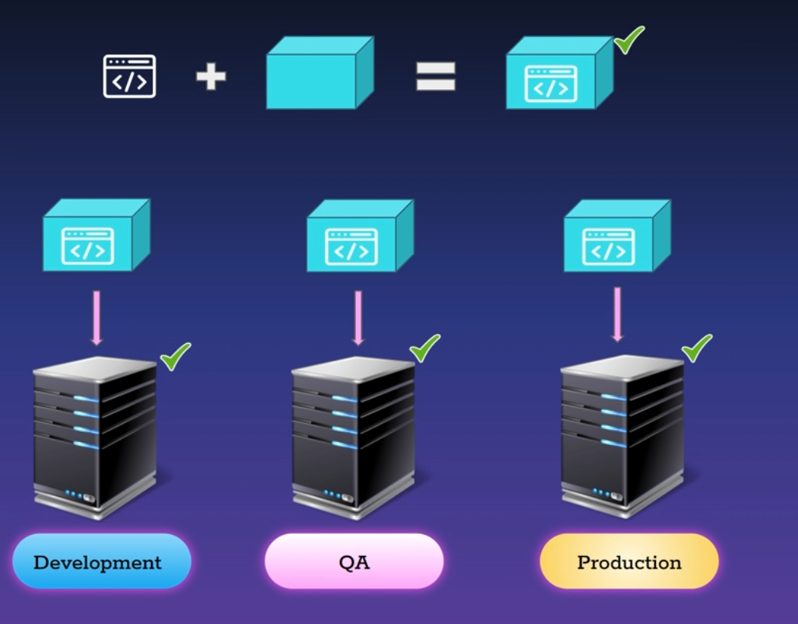

# Docker là gì?

1. Docker là nền tảng dùng để đóng gói, phân phối và triển khai application
2. Container là môi trường ảo hóa `độc lập, hoàn chỉnh, dễ thay thế`: chứa chương trình và các gói bổ sung cho chương trình chính

- Độc lập: chương trìn bên trong container không thể biết và truy cập đến các chương trình bên ngoài
- Hoàn chỉnh: container chứa đầy đủ những gì application cần
- Dễ thay thế: Container thường nhẹ nên dễ xóa cũ, tạo mới. Không mất thời gian. Khả năng scaling cao

# Tại sao lại sử dụng Container

- Khi phát triển một ứng dụng, thì ta cần phải triển khai trên nhiều môi trường khác nhau
  - Development
  - QA
  - Production
- Những môi trường ở những điều kiện khác nhau, nên nếu như môi trường development chạy ổn thì chưa chắc những môi trường còn lại vận hành trơn tru
  

# Build one run anywhere
